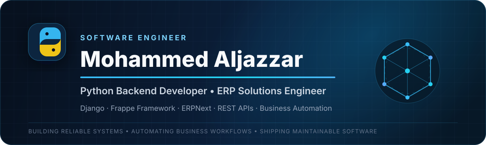

<!-- =========================================================
     Mohammed Aljazzar — Professional GitHub Profile README
     Keep the assets/profile-header.svg file inside the repo.
========================================================== -->

  

  
  
  
  

  

---

## Professional Profile

<table width="100%">
  <tr>
    <td width="62%" valign="top">
      <h3>Backend engineering with a business-first mindset</h3>
      

        I am a <strong>Python Backend Developer</strong> focused on building dependable web applications,
        ERP solutions, and workflow automation systems using <strong>Django</strong>,
        <strong>Frappe Framework</strong>, and <strong>ERPNext</strong>.
      

      

        My work starts with understanding the operation behind the feature: the users, rules, approvals,
        data flow, integrations, and long-term maintenance needs. I then translate that understanding into
        clean backend architecture and practical software.
      

    </td>
    <td width="38%" valign="top">
      <h3>Quick Snapshot</h3>
      
🔹 <strong>Primary:</strong> Python Backend Development

      
🔹 <strong>ERP:</strong> Frappe, ERPNext, Odoo

      
🔹 <strong>Web:</strong> Django, REST APIs

      
🔹 <strong>Data:</strong> MariaDB, PostgreSQL, MySQL

      
🔹 <strong>Environment:</strong> Docker, Linux, Git

      
🔹 <strong>Focus:</strong> Reliable business systems

    </td>
  </tr>
</table>

---

## Core Engineering Focus

<table width="100%">
  <tr>
    <td width="50%" valign="top">
      <h3>🐍 Backend Applications</h3>
      
Scalable Django applications, authentication, permissions, APIs, business logic, and relational data modeling.

    </td>
    <td width="50%" valign="top">
      <h3>⚙️ ERP Solutions</h3>
      
Custom DocTypes, workflows, reports, dashboards, client scripts, server scripts, and ERP integrations.

    </td>
  </tr>
  <tr>
    <td width="50%" valign="top">
      <h3>🔗 API & Integration</h3>
      
REST APIs, external service integrations, data synchronization, validation, and secure system communication.

    </td>
    <td width="50%" valign="top">
      <h3>🚀 Business Automation</h3>
      
Converting repetitive operational processes into structured, traceable, and maintainable digital workflows.

    </td>
  </tr>
</table>

---

## Technology Stack

  

  
  
  
  
  

---

## Selected Work

<table width="100%">
  <tr>
    <td width="50%" valign="top">
      <h3>🧠 Flashcards App</h3>
      
A Django-based learning application that uses spaced repetition and mastery-based card progression.

      
<strong>Key work:</strong> data modeling, review workflow, authentication, CRUD operations, and responsive UI.

      

        <code>Python</code> <code>Django</code> <code>HTML</code> <code>CSS</code>
      

      
    </td>
    <td width="50%" valign="top">
      <h3>🤝 CRM System</h3>
      
A customer relationship management system for organizing records and managing customer interactions.

      
<strong>Key work:</strong> authentication, record management, backend business logic, and database operations.

      

        <code>Python</code> <code>Django</code> <code>JavaScript</code> <code>Database</code>
      

      
    </td>
  </tr>
  <tr>
    <td width="50%" valign="top">
      <h3>📚 Library Management System</h3>
      
A structured library solution built with Frappe and ERPNext for books, members, memberships, and lending operations.

      
<strong>Key work:</strong> DocTypes, issue and return workflows, transaction tracking, and borrowing validation.

      

        <code>Python</code> <code>Frappe</code> <code>ERPNext</code> <code>MariaDB</code>
      

    </td>
    <td width="50%" valign="top">
      <h3>🏢 ERP Customization Projects</h3>
      
Business-focused ERP customizations designed around operational workflows and reporting requirements.

      
<strong>Key work:</strong> custom fields, DocTypes, workflows, automation, reports, dashboards, and reconciliation flows.

      

        <code>ERPNext</code> <code>Frappe</code> <code>Odoo</code> <code>MariaDB</code>
      

    </td>
  </tr>
</table>

  

---

## GitHub Activity

  

---

## What I Bring to a Project

<table width="100%">
  <tr>
    <td align="center" width="33%">
      <h3>01</h3>
      <strong>Business Understanding</strong>
      
I connect technical decisions with the real operational goal.

    </td>
    <td align="center" width="33%">
      <h3>02</h3>
      <strong>Maintainable Engineering</strong>
      
I build systems that remain understandable and extensible.

    </td>
    <td align="center" width="33%">
      <h3>03</h3>
      <strong>Reliable Delivery</strong>
      
I focus on validation, clear workflows, and predictable behavior.

    </td>
  </tr>
</table>

---

## Current Direction

- Building advanced systems with **ERPNext and Frappe Framework**
- Deepening backend architecture and API development with **Python and Django**
- Creating reusable solutions for **business operations and automation**
- Improving deployment workflows using **Docker and Linux**

---

## Let’s Build Something Valuable

  I am open to collaborating on backend applications, ERP solutions, integrations, and business automation projects.

  
  
  

  Designing dependable software around real business needs.

